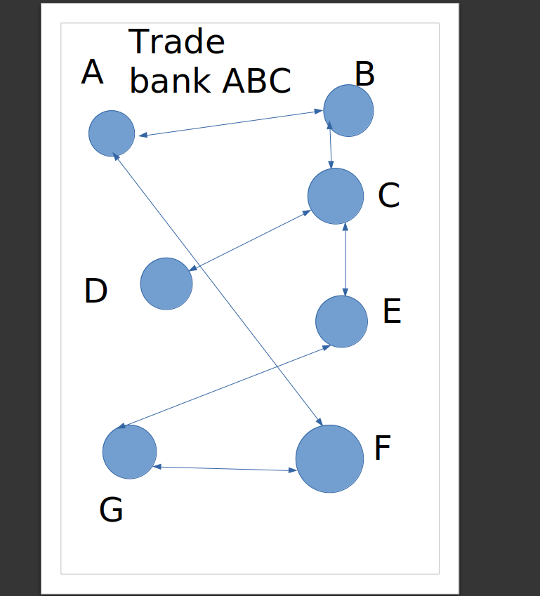

## Brief Description of our project
## Project on Currency 
## Team 4
> Prerak Srivastava ,Shubh Karman Bhullar, Knv Karthikeya, Rohan Madinei ,Sai Aaditya
## TA assigned
> Dhruv Sharma

### Objective of the project
To develop and design a currency exchange monitor that can :

1. Add or delete a trade bank.
2. Add or delete a currency.
3. Add or delete a currency conversion between two currencies.
4. Figure out the best possible path to convert the given two currencies.

## Our approach towards this problem

The first data structure that came to our mind for solving this problem was to use graphs and the various algorithms associated with graphs.

1. Create an array of all the trade-banks given by the user.
2. Each Trade-bank will have it's individual graph.
3. Each node in the graph here behaves like a node containing the currency name and it's respective weight.
4. The following graph can be represented in the form of a adjacency matrix or a list.
5. Each currency is linked to the other on the basis of the input given by the user.
6. Application of various algorithms like DFS,BFS,Dijkstra etc depending on which gives us the best case scenario in finding out the best path to convert a given currency A to a given currency B.
7. Example : If all the weights of the graph are equal it is better to use BFS rather than Dijkstra as it gives us a faster result as 
$$ Time \ complexity \ of BFS \ is \ O(V + E) \ as \ Dijkstras \ is \ O(V + E(log(V))) $$
---

This is our raw solution to the given problem statement.

---




Here A,B,C and so on depict the currencies and hence are the Vertices.
The edges are the conversions from currency X to currency Y.

## Instructions to compile and run our program

1. Clone this repositry in your local machine.
2. After cloning run this command : gcc main2.c
3. You can run the command ./a.out to get the terminal experience of our program.
4. You can also run ./a.out < Input.txt to test the input program made by us.
5. To get an understanding of how the the program works and the Input Output details please head over to the readme.md file.

### 1 : Manual Input 

1. Uncomment the lines 286,341,418,445,474,478,512 in currency2.c.
2. Uncomment the lines 23,26 and 153 in main2.c.
3. Comment the line 352 in currency2.c
4. You can run our program by running gcc main2.c followed by ./a.out in your terminal.

### 2 : Input through a program
1. Comment the lines 286,341,418,445,474,478,512 in currency2.c.
2. Comment the lines 23,26 and 153 in main2.c.
3. Uncomment the line 352 in currency2.c.
4. You can run the input program by running gcc inputprogram.c followed by ./a.out > Input2.c
5. The method to enter the input in inputprogram.c is as follows:
    
    1. Enter the total number of banks (bankno).
    2. For the next bankno lines the ith line contains 2 integers 1st one represents the number of curriences in the ith bank and 2nd one represents the density index of the graph  

$$ Density \ of \ graph \ 1 \ > \ density \ of \ graph \ 2 \ 
 \ if \ density \ index \ 1 \ < \ density \ index \ 2 $$
 ---
6. The input should look something like this

```cpp
6 
4 1
5 2 
6 8 
9 10
12 15
20 30
```
7. Then you cna run our program by running gcc main2.c followed by ./a.out < Input2.txt > output.txt.
8. The output of the program will be present in output.txt

---


Hope you like our program.
 